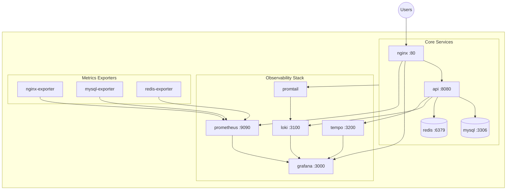
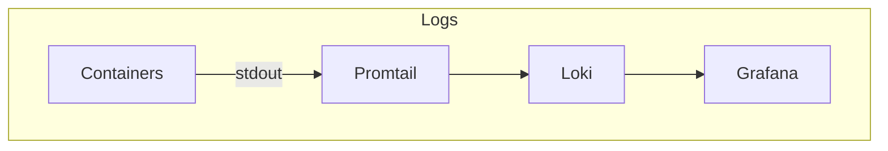
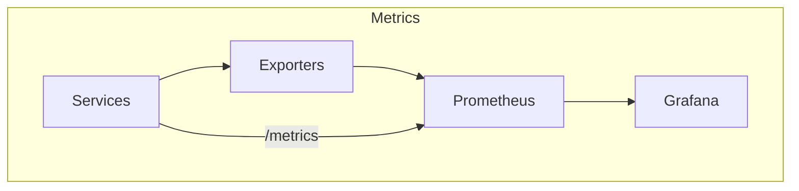
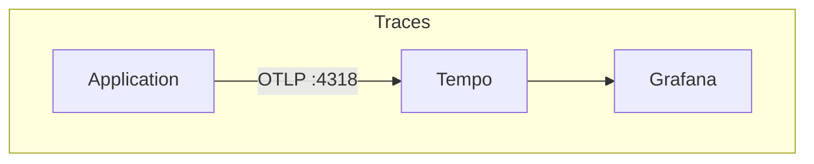

# Forge

**Self-hosted infrastructure for startups. Stop wasting time on setup.**

Forge gives you production-ready databases, caching, and observability in one command.

## Quick Start

```bash
# First time setup
make setup

# Start everything
make start

# Check status
make status
```

## Architecture



## Services

### Core Services

| Service | Purpose | Port | Description |
|---------|---------|------|-------------|
| **nginx** | Gateway | 80 | Routes all traffic, load balancing, SSL termination |
| **api** | Forge API | 8080 | REST/gRPC API for all Forge operations |
| **mysql** | Database | 3306 | Relational database with slow query logging |
| **redis** | Cache | 6379 | In-memory cache with persistence |

### Observability Stack

| Service | Purpose | Port | Description |
|---------|---------|------|-------------|
| **grafana** | Dashboards | 3000 | Visualization for metrics, logs, traces |
| **prometheus** | Metrics | 9090 | Time-series database for metrics |
| **loki** | Logs | 3100 | Log aggregation (like Prometheus for logs) |
| **tempo** | Traces | 3200 | Distributed tracing backend |
| **promtail** | Log collector | - | Ships logs from containers to Loki |

### Metrics Exporters

| Service | Purpose | Port | Description |
|---------|---------|------|-------------|
| **nginx-exporter** | Nginx metrics | 9113 | Exposes nginx stats to Prometheus |
| **mysql-exporter** | MySQL metrics | 9104 | Exposes MySQL stats to Prometheus |
| **redis-exporter** | Redis metrics | 9121 | Exposes Redis stats to Prometheus |

## Data Flow







- **Logs**: Promtail auto-discovers all `forge-*` containers and ships logs to Loki
- **Metrics**: Prometheus scrapes every 15s from exporters and `/metrics` endpoints
- **Traces**: Applications send traces via OpenTelemetry to Tempo

## URLs

| Path | Description |
|------|-------------|
| `http://localhost/` | Gateway status |
| `http://localhost/docs` | API documentation (Swagger) |
| `http://localhost/api/v1/*` | REST API |
| `http://localhost/services/grafana` | Grafana dashboards |
| `http://localhost/services/prometheus` | Prometheus UI |

## Pre-built Dashboards

Forge ships with 6 pre-configured Grafana dashboards:

| Dashboard | Description |
|-----------|-------------|
| **Forge Overview** | System health, request rates, error rates |
| **Service Uptime** | Availability %, uptime history, downtime events |
| **Nginx Gateway** | Request latency, traffic by backend, error rates |
| **MySQL** | QPS, connections, slow queries, buffer pool |
| **Redis** | Commands/sec, memory, hit ratio, keys |
| **API** | Endpoint latency, error rates, request counts |

## Python SDK

```bash
pip install forge-sdk
```

```python
from forge import Forge

f = Forge("localhost")

# Database
result = f.db.query("SELECT * FROM users")
engine = f.db.engine()  # SQLAlchemy engine

# Cache
f.cache.set("key", "value", ttl=3600)
value = f.cache.get("key")
redis = f.cache.client()  # Redis client

# Observability
f.logs.info("User logged in", user_id=123)
f.metrics.increment("requests_total")
```

## Configuration

Configuration is done via environment variables in `.env`:

```bash
# Copy example and customize
cp env.example .env
```

Key settings:

| Variable | Default | Description |
|----------|---------|-------------|
| `MYSQL_ROOT_PASSWORD` | forgeroot | MySQL root password |
| `GRAFANA_ADMIN_PASSWORD` | admin | Grafana admin password |
| `COMPOSE_PROFILES` | db,cache,observability | Which services to enable |

See `env.example` for all available options.

## Commands

| Command | Description |
|---------|-------------|
| `make setup` | First-time setup (pull images, build) |
| `make start` | Start all services |
| `make stop` | Stop all services |
| `make status` | Detailed service status with resources |
| `make health` | Quick health check |
| `make logs` | View all logs |
| `make logs-api` | View specific service logs |
| `make restart-nginx` | Restart specific service |
| `make clean` | Remove everything (including data) |

## Ports Reference

| Port | Service | Protocol |
|------|---------|----------|
| 80 | nginx | HTTP |
| 8080 | api | HTTP/gRPC |
| 3306 | mysql | MySQL |
| 6379 | redis | Redis |
| 3000 | grafana | HTTP |
| 9090 | prometheus | HTTP |
| 3100 | loki | HTTP |
| 3200 | tempo | HTTP (query) |
| 4318 | tempo | OTLP HTTP |
| 9113 | nginx-exporter | HTTP |
| 9104 | mysql-exporter | HTTP |
| 9121 | redis-exporter | HTTP |

## License

MIT
